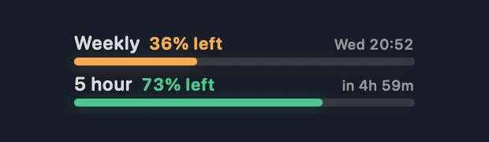

# Codex Usage

A small, transparent macOS widget that floats above your desktop and shows the remaining Codex quota for the weekly and five-hour windows.

Codex Usage is an independent community project and is not affiliated with or endorsed by OpenAI.



*The screenshot uses illustrative sample values; it does not show a real account.*

## Download

Download the latest **Codex-Usage-…-macos-universal.zip** from [GitHub Releases](../../releases/latest), unzip it, and move **Codex Usage.app** to Applications. The universal app supports both Apple silicon and Intel Macs running macOS 13 or later.

This release is ad-hoc signed and is not notarized by Apple. On first launch, macOS may block it because it was downloaded outside the App Store. In Finder, Control-click **Codex Usage.app**, choose **Open**, and confirm **Open** in the dialog. You should only need to do this once.

## Use the widget

- Drag the top area to place the widget; its position is remembered for the next launch.
- Each row shows remaining quota, a color-coded bar, and the reset time. Green means more than 50% remains, amber means 21–50%, and red means 20% or less.
- Hover over the widget to reveal refresh, settings, and quit controls. The hand icon marks the draggable area.
- The menu bar icon provides **Show Widget**, **Refresh Usage**, **Settings**, and **Quit**.
- Settings includes five sizes, refresh intervals from 30 seconds to 5 minutes, and an **Open at login** option. The widget also refreshes when it becomes active if the displayed reading is older than the selected interval.

## Usage data and privacy

The app asks the locally installed Codex CLI app-server for account rate limits. It does not read or write Codex credential files. The CLI uses its existing sign-in and handles its own connection to Codex. No analytics or telemetry are added by this app. Availability and reset times depend on the data returned for the signed-in account; a window may be unavailable for some plans.

## Build from source

Requirements: macOS 13 or later, Swift 5.9 or later, and a signed-in Codex CLI installation.

```sh
./scripts/build-app.sh
open "build/Codex Usage.app"
```

To make a local universal release archive:

```sh
./scripts/release-macos.sh 1.0.0
```

The archive and SHA-256 checksum are written to `build/release/`. GitHub Actions runs the same release script and publishes these files when a `v*` version tag is pushed.

## License

Released under the MIT License. See [`LICENSE`](LICENSE).
